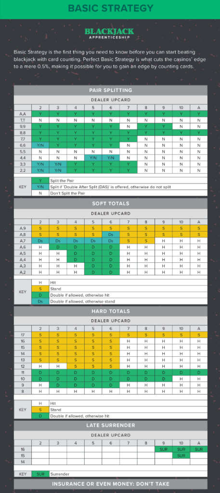

# Blackjack Pilot 🃏

Modern AI-powered Blackjack Assistant and YOLO11 training workspace featuring real-time card detection, Hi-Lo card counting, and instant Basic Strategy recommendations.

---

## 📁 Project Structure

```text
blackjack-pilot/
├── main.py                     # Main application (PySide6 GUI, live screen capture)
├── blackjack_strategy.py       # Basic Strategy engine (hard, soft, pair splits, Illustrious 18)
├── card_counter.py             # Hi-Lo card counter & True Count estimation
├── round_stats.py              # Statistics, win rate tracking, and round evaluation
├── requirements.txt            # Python dependencies
├── docs/
│   └── basic_strategy.png      # Basic Strategy reference chart
├── models/
│   └── yolo11m_blackjack_1280.pt # Trained YOLO11m model @ 1280p (97.4% mAP50)
├── dataset/                    # Dataset directory structure for training
│   ├── data.yaml               # YOLO dataset configuration
│   ├── train/images/ & labels/
│   ├── valid/images/ & labels/
│   └── test/images/ & labels/
└── training/                   # Model training & analysis utilities
    ├── train.py                # Train YOLO11m at 1280p widescreen (GPU optimized)
    ├── test.py                 # Interactive image detection tester
    └── video2image.py          # Automatic frame extractor from gameplay videos
```

---

## 🚀 Getting Started

### 1. Install Dependencies
```bash
pip install -r requirements.txt
```

### 2. Launch the Application
```bash
python main.py
```

### 3. Usage & Setup
1. **Select Video Feed**: Click **📹 1. Select Full Video Feed** and drag a rectangle over the blackjack table (e.g. video window, browser stream, or full screen).
2. **Define Sub-Zones**:
   - Click **👑 2. Select Dealer Zone** and drag a box over the dealer's card placement area.
   - Click **👤 3. Select Player Zone** and drag a box over your personal card box / hand area.
3. **Play**: The system identifies cards in real time, displays dealer upcard, your hand total, the running/true count, and optimal Basic Strategy actions (Hit, Stand, Double, Split, Surrender).

---

## 📊 Basic Strategy Chart

The assistant implements standard casino multi-deck basic strategy rules with optional count-based Illustrious 18 deviations:

<p align="center">
  
</p>

### Strategy Legend:
- **Hard Totals**: Decisions based on non-Ace totals (or hands where Ace must count as 1 to avoid busting).
- **Soft Totals**: Hands containing an Ace counted as 11 (e.g., A,7 = Soft 18).
- **Pair Splitting**: Options to split identical-rank cards into two independent hands.
- **Surrender**: Forfeit half the bet on high-risk matchups when late surrender is offered.

---

## 🛠️ Training & Model Tools

### Test the Model on Images:
```bash
python training/test.py
```
*(Press Space/Enter for next image, 'q' or ESC to exit)*

### Extract Video Frames for Training:
```bash
python training/video2image.py
```

### Train a New YOLO11 Model:
Place images and annotations in `dataset/train` and `dataset/valid`, then run:
```bash
python training/train.py
```
*(When training finishes, the best weights are automatically copied to `models/yolo11m_blackjack_1280.pt`)*
